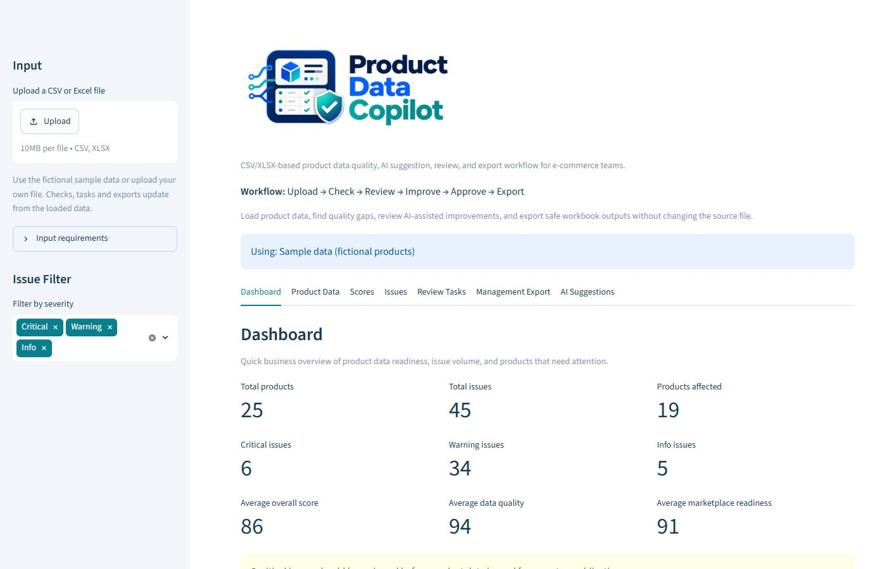

# Product Data Copilot

Product Data Copilot is a local Streamlit application for reviewing e-commerce product data before publication. It turns a CSV or XLSX file into visible quality issues, explainable readiness scores, prioritized review tasks, optional AI drafts, and safe handoff exports. The intended users are product-data and e-commerce operations teams.

The product question is: **Which product records need attention, why, and what can a reviewer safely hand off next?** The app supports that decision; it does not publish listings or certify compliance.

*The local dashboard highlights catalog size, open issues and readiness using fictional sample data.*

## Try the workflow

1. Install Python and create an isolated environment: `python -m venv .venv`. The verified environment used Python **3.14.4** on Windows.
2. Install dependencies: `.venv\Scripts\python.exe -m pip install -r requirements.txt` on Windows, or `.venv/bin/python -m pip install -r requirements.txt` on macOS/Linux.
3. Start the app: `.venv\Scripts\python.exe -m streamlit run app.py` on Windows, or `.venv/bin/python -m streamlit run app.py` on macOS/Linux. On Windows, `start_app.bat` also uses `.venv` when available.
4. The app opens with 25 fictional sample products. Inspect the Dashboard, Scores, Issues, and Review Tasks tabs, or upload your own file.
5. Download the management workbook or CSV tables. With an `OPENAI_API_KEY`, optionally generate suggestions for one selected product, review structured suggestions, and download an improvement workbook.

The sample file at [data/sample_products.csv](data/sample_products.csv) is fictional and deliberately contains quality gaps. No API key is needed for the core audit and export workflow.

## Input contract

- UTF-8 CSV with comma, semicolon, or tab delimiter, or the first worksheet of an XLSX file. File extension is case-insensitive.
- Required columns: `sku` and `product_name`. Other supported fields include `category`, `description`, `brand`, `manufacturer`, `attributes`, `ean`, `language`, `price`, `image_url`, `warning_notes`, `translation_de`, and `translation_en`.
- Every SKU must be non-empty and unique. The app rejects ambiguous files before it assigns issues, decisions, or suggestions to products.
- Limits for this local MVP: 10 MB, 1,000 products, and 100 columns. Invalid and empty files show a recoverable error.
- Identifiers are read as text, so leading zeros in CSV are preserved. In Excel, format SKU and EAN cells as text **before** entering them; zeros already removed by Excel cannot be recovered.

## What the results mean

Checks identify missing or weak titles/descriptions, missing fields and translations, invalid prices or EAN/GTIN checksums, suspicious image URLs, and missing warning notes for selected safety-relevant categories. Issues include their affected SKU, field, severity, reason, and recommended action. Review Tasks make these issues actionable.

The five component scores cover data quality, marketplace readiness, translations, compliance-related completeness, and AI-content readiness. Overall readiness combines them with weights of 35%, 25%, 15%, 15%, and 10%. Scores are prioritization indicators, **not** marketplace acceptance or legal compliance decisions. A critical issue forces the status to Critical; another open issue prevents a Ready label even when the numeric score is high. Manual export-ready review statuses cannot override those gates.

## AI and review boundary

The default audit runs locally. AI calls occur only when the user clicks a generation button and has configured `OPENAI_API_KEY` in an ignored `.env` file (see [.env.example](.env.example)). The selected product's fields, issue context, and review context are sent to OpenAI. `OPENAI_MODEL` can override the configured model. There is no automatic bulk generation.

The classic AI output (v1) is an **unreviewed draft** in the management export. Structured Smart Suggestions (v2) are checked against the selected SKU, existing source fields, editable target field, and current value. Invalid or unsupported suggestions are blocked. Every fresh generation starts with no inherited approvals. A person can approve a valid suggestion for export, but approval lasts only for the current Streamlit session and does not alter the source file. These checks establish provenance and prevent simple mismatches; they cannot prove that a generated claim or translation is factually correct. A reviewer must verify content before use.

## Exports and data handling

The management workbook contains an overview, scores, issues, tasks, optional v1 drafts, and an original source snapshot. The improvement workbook groups v2 suggestions by approved, pending, rejected, blocked, and unknown status and also includes the source snapshot. User-provided text is serialized so spreadsheet software does not evaluate it as a formula; numeric score cells can remain numeric. Exports are generated in memory and downloaded locally; the app does not write back to an uploaded product file. Review state is session-only.

## Engineering notes

`app.py` owns the Streamlit flow. Import-safe modules under `src/product_data_copilot/` implement input validation, rules, scoring, review state, AI parsing and source validation, and export serialization. The app is deliberately a local MVP; it has no accounts, database, deployment, marketplace integration, automatic approval, or automatic publication.

Run the automated suite with `python -m pytest`. The latest local verification on 27 September 2026 passed **186 tests** in a fresh virtual environment. Browser checks covered the normal sample-data experience; a live OpenAI response and a manual Microsoft Excel visual check are still separate acceptance checks. See the [MVP requirements](docs/product_requirements.md), [requirements and verification](docs/requirements_traceability.md), and [case study](docs/portfolio_case_study.md) for the product decisions and evidence.

The repository has no license file and remains private by owner choice. On 27 September 2026 its GitHub URL returned **404 to a signed-out visitor** even though the latest commit was pushed. Treat source access as available on request to explicitly invited GitHub users; do not present the private URL as a freely accessible portfolio link.
