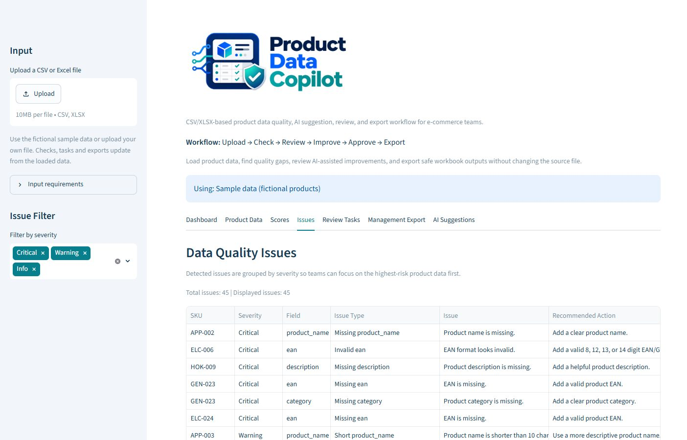

# Product Data Copilot — product case study

## Problem and audience

Product-data teams receive supplier spreadsheets and must decide which records are complete enough to work with, which need correction, and what evidence supports that decision. Manually scanning rows makes it hard to prioritize critical gaps and to distinguish a suggested improvement from a verified fact. Product Data Copilot addresses this review problem for product-data managers, marketplace operations, and content teams.

The project is a local Streamlit MVP. Its goal is a clear, testable handoff workflow, not an enterprise PIM or an automatic publishing system.

## Workflow and decisions

1. **Load:** Start with fictional sample data or upload UTF-8 CSV / XLSX. `sku` and `product_name` are required. Duplicate or missing SKUs stop the analysis because assigning findings to the wrong product would be worse than asking for a corrected file. Identifiers remain text; CSV leading zeros are preserved.
2. **Assess:** Deterministic rules produce issues with a field, severity, reason, and recommended action. Five component scores and a weighted overall score help sort work. A critical issue forces Critical and any other open issue prevents Ready, even when the numeric score is high. This makes the score a prioritization aid rather than a substitute for reviewing the findings.
3. **Plan work:** The same issue records drive Review Tasks, filters, and a management export. Manual review status is session-only and cannot override a failed readiness gate.
4. **Suggest:** AI is optional and runs only for the selected product when requested. The classic output is explicitly an unreviewed draft. Structured V2 suggestions carry a field, old and proposed value, source fields, reason, and risk context. The app checks that the SKU, source fields, target field, and old value match the loaded record. Unsupported proposals are blocked.
5. **Decide and hand off:** A person can approve or reject a valid V2 proposal. Every new generation resets approvals. The improvement workbook separates approved, pending, rejected, blocked, and unknown proposals and includes the original product snapshot. Approved means *candidate for handoff*, not an update to a product system.

*Critical findings appear first; the same issue records feed review tasks and exports.*

The rule engine is intentionally generic. It cannot certify retailer acceptance, image quality, or legal compliance. Even a source-matched AI proposal can contain a false or misleading statement; human review is necessary.

## Requirements-engineering rationale

The central requirements are traceable from user need to acceptance evidence in [requirements_traceability.md](requirements_traceability.md). Several boundaries shaped the implementation:

- **Unambiguous identity before analysis:** SKU is the key used throughout review and export. The loader rejects ambiguity early instead of trying to repair or guess it.
- **Explainability over a single grade:** users can move from dashboard totals to the exact issue and review task. The overall score is constrained by issue severity so the label cannot contradict visible findings.
- **Human control of generated content:** AI does not approve itself, and a new response cannot reuse an old decision. Provenance checks narrow the risk of mismatched or invented sources but do not claim semantic truth.
- **Reversible output:** exports are generated in memory; the original file is never overwritten. CSV and XLSX cells are written safely as text so imported product content does not become a spreadsheet formula.
- **Honest scope:** a local, single-session tool can demonstrate the core review decision without prematurely building logins, databases, integrations, or hosting.

## Implementation and evidence

`app.py` contains the Streamlit interaction flow. Pure modules under `src/product_data_copilot/` handle loading, validation, scoring, state boundaries, AI normalization, and export serialization. This keeps the high-risk logic independently testable while leaving the interface small enough for a local MVP.

The latest local run on 27 September 2026 passed **188 automated tests** in the tested Python 3.14.4 environment. Tests cover invalid imports, leading-zero identifiers, issue/status gates, dataset and response changes, AI source checks, workbook/CSV cell safety, and both AI request paths through the installed SDK with a fake key and in-memory HTTP response. A browser walkthrough opened all seven tabs with fictional sample data and found no app or browser errors. No real provider call was made, so live AI output and factual quality remain unverified. Microsoft Excel's visual rendering remains a manual acceptance check; see [requirements_traceability.md](requirements_traceability.md).

## Limitations and next decision

There is no persistence across sessions, multi-user review, marketplace-specific rules, integration, automatic AI generation across all products, automatic write-back, or legal/compliance guarantee. The next product decision would be whether real users find the issue-to-task-to-handoff loop useful; that evidence should come before infrastructure or integration work.

The [README](../README.md) contains the setup, input contract, and reviewer-facing usage instructions.
